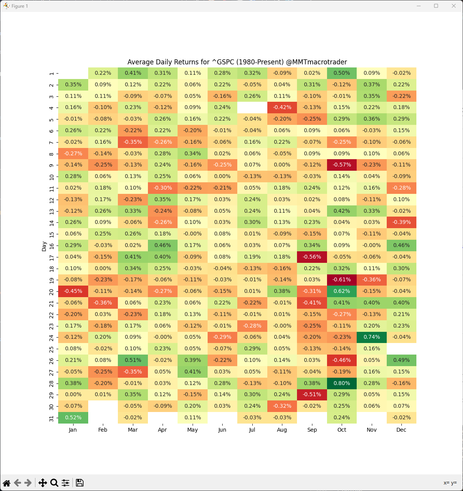
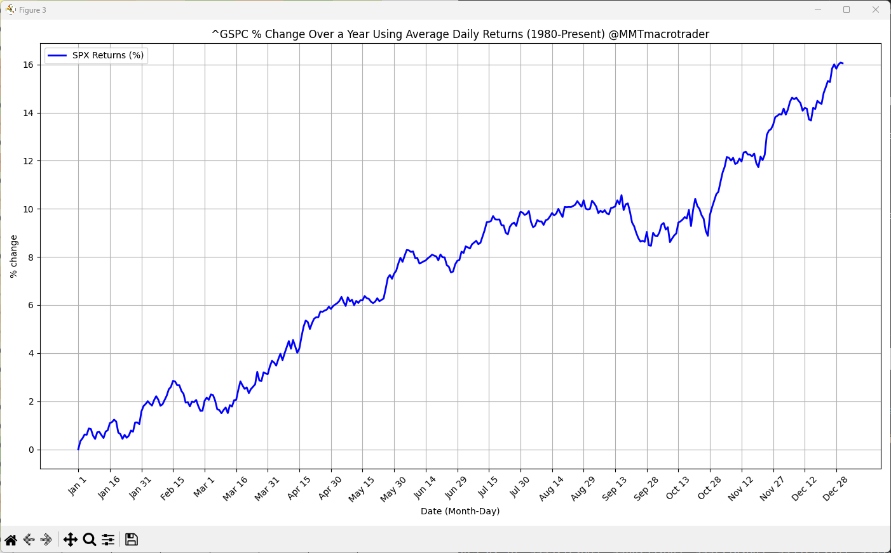

# Seasonality Heatmap Plot





## Setup

To install required packages:

```console
> pip install -r requirements.txt
```
## Run

Generate default SPX (^GSPC) heatmap graphs:

```console
> python seasonality-heatmap.py
```

Generate heatmap graphs for user provided ticker name e.g. Apple (AAPL)

```console
> python sesonality-heatmap.py -t AAPL
```

## Links

[](https://x.com/MMTmacrotrader)

[](https://www.youtube.com/@MMTMacroTrader)

[](https://www.Patreon.com/mmtmacrotrader)
